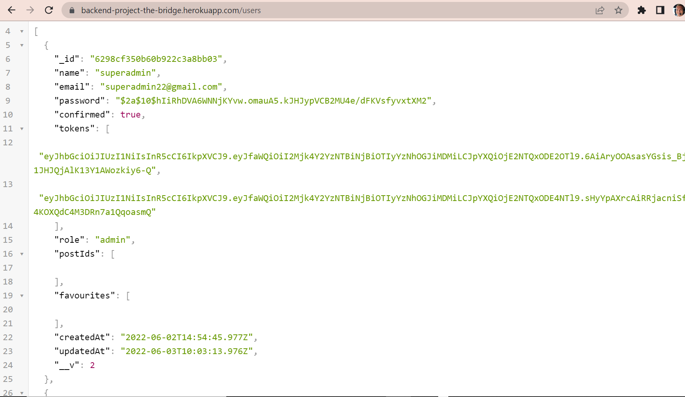
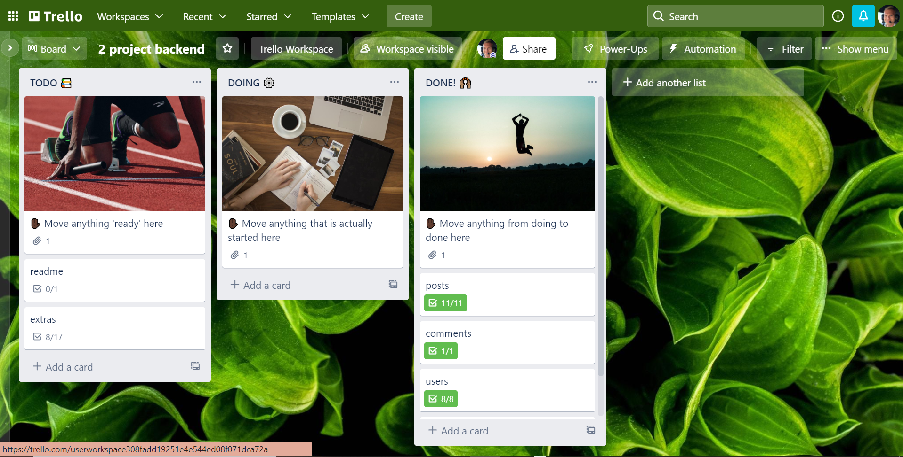
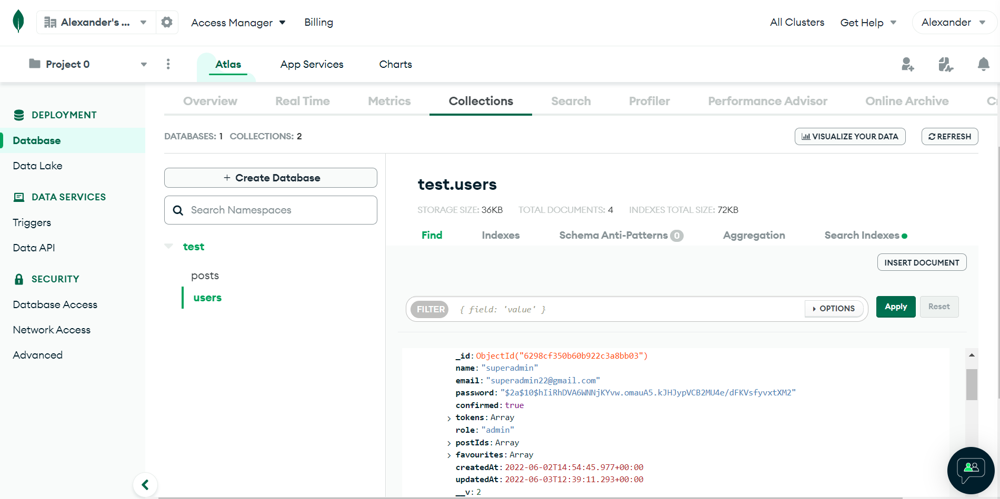
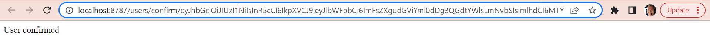
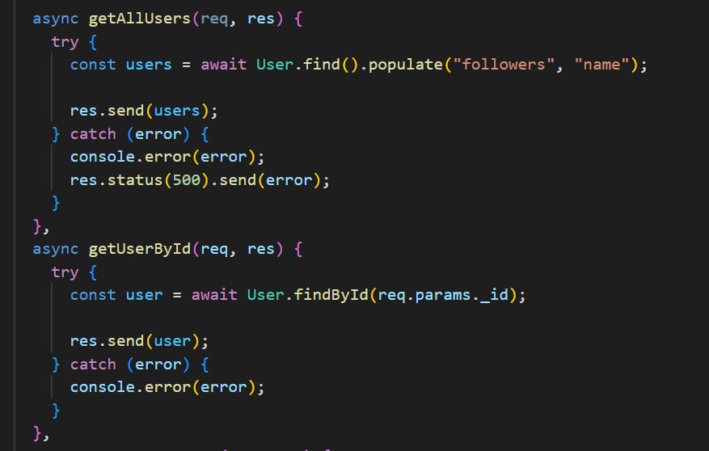

# Backend project
The project will involve Javascript, Express, Node.js, mongodb, mongoose. 
I have created a social network. This includes posts, users, comments, likes, unlikes, follows and followers.

## Description

### It is expected that the student develops a REST API that is capable of the following:
* User registration using Bcrypt.
* User login + token + middleware.
* That is capable of creating a CRUD.
* Give + take away "Like" a post.
* Backend available in production (Heroku).

### Essential requirements of the project:
* Use of branches with git, when the project is finished there should be two branches, the master or main and the develop.
* Excellent README presentation.

### Technologies used
* Javascript
* Express
* Node.js
* MongoDB
* Mongoose

For the development of the API we will use MongoDB with Mongoose and express.
The project will be uploaded to a public GitHub repository and the
existence of branches, as well as several commits of high readable quality for
analyze the evolution of the project.

## Screenshots

### Diagram
A screenshot of the users section in Heroku.

### Trello
I have been working using Trello. All the instructions of the project I imported into Trello and have been ticking them off as we go.

### MongoDB database
In this project we have been using mysql. Here you can see the seeders we have created to practice and test endpoints. 

### Postman

### Screenshot of when a users confirms their registration to my social network.  

### Dependencies

* "bcrypt": "^5.0.1"
* "bcryptjs": "^2.4.3"
* "express": "^4.18.1"
* "jsonwebtoken": "^8.5.1"
* "dotenv": "^16.0.1",
* "nodemailer": "^6.7.5"
* "sequelize": "^6.19.2"
* "mongoose": "^6.3.5"

### Examples of endpoint
This end point will create a category

## Grateful

I want to thank our teachers for their help and pacience with me during this time working on this project.
 [Sofia](https://github.com/SofiaPinilla),[Ger](https://github.com/GeerDev),[Iván](https://github.com/ivanpuebla10)

## Authors

[Alex (@alextebbitt)](https://github.com/alextebbitt) & [tianfanshan (@tianfanshan)](https://github.com/tianfanshan)

## License

This project is licensed under the [Alex Tebbitt](https://github.com/alextebbitt) & License - see the LICENSE.md file for details